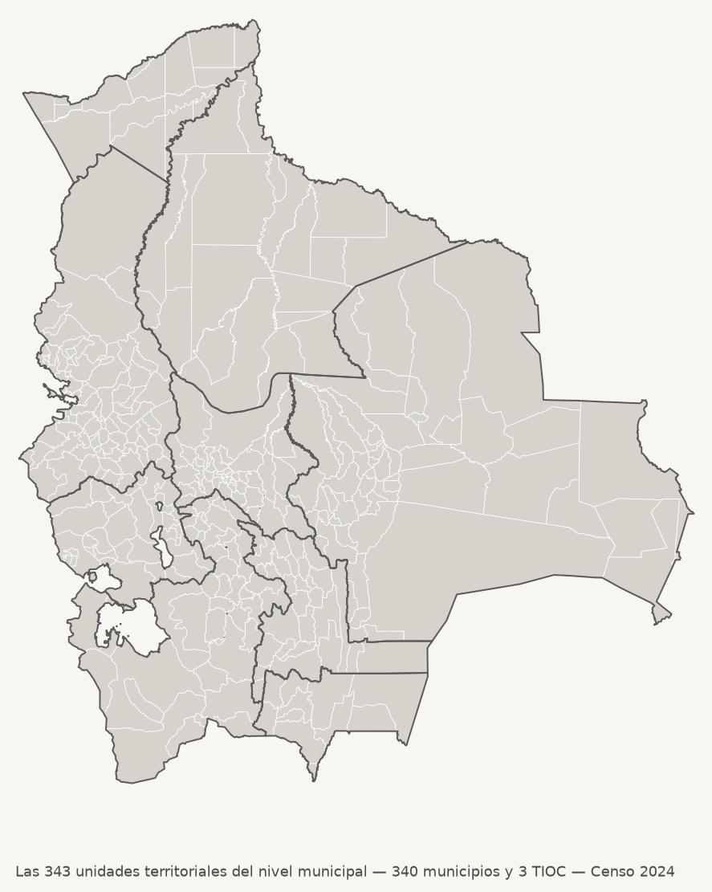

# Unidades territoriales del nivel municipal de Bolivia — 343 (CPV-2024)

<picture>
  <source media="(prefers-color-scheme: dark)" srcset="img/mapa-dark.png">
  
</picture>

Geografía del nivel municipal lista para usar: las **343 unidades territoriales**
que reconoce el Censo de Población y Vivienda 2024 —**340 municipios y 3 TIOC**,
gobernados por 335 autonomías municipales y 8 autonomías indígenas— con los
códigos del INE que usan los microdatos censales.

**→ [Sitio con mapa interactivo y descargas](https://lab-tecnosocial.github.io/municipios-bolivia-2024/)**

> **Uso referencial.** Estos polígonos sirven para mapear y agregar datos, no para
> dirimir cuestiones de jurisdicción. Bolivia tiene procesos de delimitación
> abiertos entre municipios y departamentos, y esta capa no es una fuente
> autoritativa sobre ellos.

## Unidad territorial no es lo mismo que entidad autónoma

Vas a encontrar fuentes serias que dicen que Bolivia tiene **335** municipios,
otras que dicen **340** y otras **343**. Todas pueden tener razón: la ley boliviana
distingue dos cosas que es fácil confundir.

| Concepto | Qué es | Definición legal |
|---|---|---|
| **Unidad territorial** | La *geometría*: el pedazo de territorio delimitado. | «Un espacio geográfico delimitado para la organización del territorio del Estado, pudiendo ser departamento, provincia, municipio o territorio indígena originario campesino» — Ley 031, art. 6.I.1 |
| **Entidad territorial autónoma (ETA)** | El *gobierno* que administra esa geometría. | «La institucionalidad que administra y gobierna en la jurisdicción de una unidad territorial» — Ley 031, art. 6.II.1 — cuando tiene la cualidad gubernativa del art. 272 de la Constitución |

Esta capa tiene **343 polígonos**, y las dos cuentas dan 343: lo que cambia es cómo
se agrupan.

| Si cuentas… | El desglose es | Total |
|---|---|---|
| unidades territoriales | 340 municipios + 3 territorios indígena originario campesinos (TIOC) | **343** |
| entidades territoriales autónomas | 335 autonomías municipales + 8 autonomías indígena originario campesinas (AIOC) | **343** |

La clave está en el **artículo 15.IV de la Ley 031**: «la conversión de un municipio
en autonomía indígena originaria campesina *no significa la creación de una nueva
unidad territorial*». Por eso cinco de las ocho AIOC siguen siendo municipios en el
mapa —solo cambiaron de tipo de gobierno— y solo tres son TIOC, una clase distinta
de unidad territorial que, al aprobarse por ley, adquiere el «doble carácter» del
art. 6.I.2. El INE lo refleja en los propios nombres: solo esas tres llevan el
prefijo `TIOC-`.

Las ocho AIOC, cada una con su código INE:

| Nombre en la capa | Código | Departamento | Unidad territorial | Vía de acceso |
|---|---|---|---|---|
| Charagua (Autonomía Guaraní Charagua Iyambae) | `070702` | Santa Cruz | municipio | conversión de municipio |
| Gutiérrez (Autonomía Indígena Kereimba Iyaambae) | `070705` | Santa Cruz | municipio | conversión de municipio |
| Huacaya (Autonomía Guaraní Chaqueño de Huacaya) | `011002` | Chuquisaca | municipio | conversión de municipio |
| Salinas de Garci Mendoza (AIOC de Salinas) | `040801` | Oruro | municipio | conversión de municipio |
| Uru Chipaya (Nación Originaria Uru Chipaya) | `040903` | Oruro | municipio | conversión de municipio |
| TIOC-Raqaypampa | `031304` | Cochabamba | TIOC | vía territorio |
| TIOC-Jatun Ayllu Yura | `051204` | Potosí | TIOC | vía territorio |
| TIOC-Territorio Indígena Multiétnico | `080901` | Beni | TIOC | vía territorio |

Los tres TIOC son parte de [las cuatro unidades que suelen
faltar](#las-cuatro-unidades-que-suelen-faltar) en la cartografía que circula.

Hay unos 25 procesos más en trámite, así que el reparto 335/8 se moverá con los
años. El total de 343 solo cambia si se crean, fusionan o suprimen unidades
territoriales, no por nuevas conversiones.

### Dónde encaja esto en el sistema de autonomías

La Constitución de 2009 organiza el territorio en departamentos, provincias,
municipios y TIOC (art. 269), y reconoce cuatro tipos de autonomía, sin
subordinación entre sí y con igual rango constitucional (art. 276):

| Tipo de ETA | Cuántas | Sobre qué unidad territorial | ¿En esta capa? |
|---|---|---|---|
| Autonomía departamental | 9 | departamento | solo el contorno, en `departamentos_bolivia` |
| Autonomía regional | 1 | región (provincia Gran Chaco, Tarija) | no |
| Autonomía municipal | 335 | municipio | sí |
| Autonomía indígena originario campesina | 8 | municipio (5) o TIOC (3) | sí |

La **autonomía regional del Gran Chaco** —la única del país, con estatuto aprobado
en referéndum en 2016— se *superpone* a Yacuiba, Caraparí y Villa Montes sin
reemplazarlos: esos tres siguen siendo municipios con su propio gobierno, y así
aparecen aquí.

Las **112 provincias** son unidades territoriales pero *no* tienen autonomía: no son
ETA y no existe un «gobierno provincial». Sirven de agrupación administrativa, y por
eso van como columna (`iprov`, `nombre_prov`) y no como capa propia.

## Archivos

| Archivo | Detalle | Peso | Para qué |
|---|---|---|---|
| `municipios_bolivia_2024.geojson` | 55.605 vértices | 1,6 MB | **El de uso general.** Mapas nacionales y departamentales, web, coropletas |
| `municipios_bolivia_2024_shp.zip` | los mismos, en shapefile | 548 KB | ArcGIS y quien lo pida así |
| `municipios_bolivia_2024.gpkg` | las 343 + los 9 departamentos | 1,4 MB | Un solo archivo, sin truncar nombres de campo |
| `municipios_bolivia_2024_detalle.topojson` | 741.926 vértices | 10,8 MB (3,3 MB gzip) | Zoom fino de bordes, recortes, análisis espacial preciso |
| `municipios_bolivia_2024_detalle_shp.zip` | los mismos, en shapefile | 8,2 MB | El detalle completo en un SIG de escritorio |
| `departamentos_bolivia.geojson` | 9 polígonos | 0,3 MB | Contorno departamental para superponer |
| `departamentos_bolivia_shp.zip` | los mismos, en shapefile | 137 KB | |
| `municipios_bolivia_2024.csv` | 343 filas | 28 KB | La tabla sin geometría, para joins rápidos |

Los shapefile y el GeoPackage se generan desde los GeoJSON/TopoJSON con
`./build/generar-descargas.py`, que se ejecuta solo (uv resuelve sus dependencias).
No los edites a mano: son salidas, no fuentes.

**CRS:** WGS84 / EPSG:4326 en todos. Geometrías válidas y topológicamente limpias
(0 inválidas en los cuatro archivos).

Los departamentos salen de disolver las 343 unidades, así que sus bordes caen
exactamente sobre los municipales: se pueden superponer sin desajustes.

### Notas sobre el TopoJSON

- **No declara CRS**, porque la especificación de TopoJSON asume WGS84. Algunas
  herramientas lo reportan como `NA`; asígnale EPSG:4326 y listo
  (`sf::st_crs(x) <- 4326`).
- **Sin cuantización**, a propósito. La cuantización es lo que suele hacer pequeño
  a un TopoJSON, pero en una capa con 742.000 vértices tan densos colapsa vértices
  contiguos y deja aristas degeneradas. Sin cuantizar queda limpio y aun así
  pesa la mitad que el GeoJSON equivalente (22,2 MB).
- Trae el código INE como `id` del objeto, además de la columna `codigo_ine`.

## Columnas

| Columna | Ejemplo | Nota |
|---|---|---|
| `idep` | `"01"` | Departamento, 2 dígitos con cero a la izquierda |
| `nombre_dep` | `"Chuquisaca"` | |
| `iprov` | `"01"` | Provincia. Ojo: 113 valores para 112 provincias reales (ver abajo) |
| `nombre_prov` | `"Oropeza"` | |
| `imun` | `"01"` | Municipio dentro de la provincia |
| `nombre_mun` | `"Sucre"` | Nombre del INE |
| `capital` | `"Sucre"` | Capital municipal |
| `superficie_km2` | `1671.1` | |
| `codigo_ine` | `"010101"` | Los tres códigos concatenados. Está en todos menos en el GeoJSON general |

En **shapefile** dos columnas se acortan, porque el formato trunca los nombres a
10 caracteres: `nombre_prov` → `nombre_pro` y `superficie_km2` → `superficie`.
El resto de nombres no cambia. El `.cpg` fuerza UTF-8, así que los acentos salen
bien. Si esto molesta, usa el **GeoPackage**, que conserva los nombres completos.

La clave para unir con datos censales es **`idep + iprov + imun`**. Ojo con los
ceros a la izquierda: si tu herramienta lee los códigos como número, `"01"` se
vuelve `1` y el join falla en silencio. Léelos como texto.

### La provincia número 113

Bolivia tiene 112 provincias, pero `iprov` arroja 113 valores distintos. No es un
error de los datos: el TIOC-Territorio Indígena Multiétnico no está dentro de
ninguna provincia del Beni, y para encajarlo en la estructura `dep/prov/mun` el INE
le dio un código de provincia propio. Los otros dos TIOC sí caen dentro de una
provincia real (Mizque y Antonio Quijarro). Si cuentas provincias con este archivo,
descuenta esa.

## Cómo usarla

No hace falta descargar nada: todos los archivos se leen directo desde la URL.
La base es:

```
https://lab-tecnosocial.github.io/municipios-bolivia-2024/
```

### R

```r
library(sf)

base <- "https://lab-tecnosocial.github.io/municipios-bolivia-2024/"

mun <- st_read(paste0(base, "municipios_bolivia_2024.geojson"))
# Simple feature collection with 343 features and 8 fields

# Versión de detalle: no declara CRS, hay que asignarlo
det <- st_read(paste0(base, "municipios_bolivia_2024_detalle.topojson"))
st_crs(det) <- 4326

# Unir con tus datos por la clave de tres partes
mun <- merge(mun, mis_datos, by = c("idep", "iprov", "imun"))
```

Si trabajas con los censos bolivianos, el paquete
[**censosbo**](https://lab-tecnosocial.github.io/censosbo/) ya trae esta capa en
`geo_municipios`, sin descarga.

### Python

```python
import geopandas as gpd, pandas as pd

BASE = "https://lab-tecnosocial.github.io/municipios-bolivia-2024/"

mun = gpd.read_file(BASE + "municipios_bolivia_2024.geojson")
mun.crs          # EPSG:4326
len(mun)         # 343

det = gpd.read_file(BASE + "municipios_bolivia_2024_detalle.topojson")
det = det.set_crs(4326)     # el TopoJSON llega sin CRS

# El CSV SÍ necesita que fuerces texto, o pandas convierte "010101" en 10101
tabla = pd.read_csv(BASE + "municipios_bolivia_2024.csv",
                    dtype={"codigo_ine": str, "idep": str, "iprov": str, "imun": str})
```

En los GeoJSON los códigos ya vienen como texto y se preservan solos; el `dtype`
solo hace falta para el CSV.

### QGIS

Sin descargar, por protocolo:

1. **Capa → Añadir capa → Añadir capa vectorial** (o `Ctrl+Shift+V`).
2. En *Tipo de origen* elige **Protocolo: HTTP(S), cloud, etc.**
3. Pega la URL del archivo en *URI* y pulsa **Añadir**.

También puedes escribir la ruta con el prefijo de GDAL en cualquier diálogo que
acepte un origen vectorial:

```
/vsicurl/https://lab-tecnosocial.github.io/municipios-bolivia-2024/municipios_bolivia_2024.geojson
```

O, más simple todavía: descarga el `.geojson` y arrástralo al lienzo. QGIS lee
GeoJSON y TopoJSON de forma nativa y toma el CRS del archivo; en el TopoJSON,
que no lo declara, asígnale EPSG:4326 con clic derecho → *Propiedades → Fuente*.

### ArcGIS

En **ArcGIS Pro**, descarga el `.geojson` y añádelo con *Map → Add Data*; para
convertirlo a feature class usa la herramienta **JSON To Features**
(*Conversion Tools*) con el formato de entrada en `GEOJSON`. En **ArcGIS Online**
puedes añadirlo por URL desde *Add → Add layer from URL* eligiendo el tipo GeoJSON.

El TopoJSON no lo soporta ArcGIS: conviértelo antes a GeoJSON o shapefile, por
ejemplo con

```bash
ogr2ogr -f GeoJSON municipios_detalle.geojson municipios_bolivia_2024_detalle.topojson
```

> Los ejemplos de R, Python y QGIS están probados contra las URL de este repo.
> Los de ArcGIS no: no tengo forma de ejecutarlos, así que van según la
> documentación del producto. Si algo no calza, abre un issue.

## Cómo se construyó

Ninguna fuente pública tiene a la vez la geometría de las 343 unidades y la
codificación que usan los microdatos del censo, así que la capa cruza tres fuentes:

1. **Municipios de GeoBolivia** de 2015
2. **Códigos `idep`/`iprov`/`imun` y nombres** — INE Bolivia (Redatam, CPV-2024),
   para que coincidan exactamente con los microdatos censales.
3. **Geometría, capital y superficie** — [SDSN
   Bolivia](https://sdsnbolivia.org/datos-espaciales/), capa del Atlas Municipal de los ODS (junio 2025). Es la única pública que cubre las 343 unidades: los 339 municipios más las cuatro unidades territoriales creadas entre 2016 y 2023. A su vez se armó
   sobre el archivo oficial del Ministerio de Autonomías (2015, publicado en
   GeoBolivia) y las leyes de creación de esas cuatro unidades.
4. **El emparejamiento** — los ~21.000 puntos de comunidades del
   CPV-2024 del geoportal del INE, que llevan el código del INE y sirven de árbitro
   para asignarle a cada polígono el suyo. Hizo falta porque el `Codigo_INE` del
   shapefile de SDSN parece desalineado en 7 municipios de Omasuyos (La Paz) y
   Ñuflo de Chávez (Santa Cruz) — le pone a San Ramón el código de San Julián, y
   así. Los nombres sí van con el polígono correcto; solo la columna de código está
   mal pegada. Aquí ya está corregido.

La versión simplificada se hizo con [mapshaper](https://github.com/mbloch/mapshaper) (Visvalingam sobre arcos compartidos, `keep = 0.05`), que **preserva la topología**: los bordes entre vecinos quedan idénticos y no aparecen franjas vacías. Si necesitas simplificar más, usa mapshaper y no un simplificador por polígono (`st_simplify` de sf,
`shapely.simplify`): esos tratan cada polígono por separado, rompen los bordes
compartidos y dejan huecos.

Los únicos huecos interiores del país son cuerpos de agua fuera de la división
municipal: el Salar de Uyuni (9.476 km²) y los lagos Poopó (1.285) y Uru Uru (116).

## Validación

- **Puntos del CPV-2024 dentro de su municipio:** 97,53% en la versión de detalle,
  97,30% en la simplificada. El resto son puntos prácticamente sobre el borde.
- La **población** de la fuente coincide **exactamente en las 343 unidades** con el
  conteo de los microdatos del CPV-2024: 11.365.333 personas.
  (Con el `Codigo_INE` sin corregir coincidía en 336 — es lo que delató el error.)

## Las cuatro unidades que suelen faltar

Casi toda la cartografía municipal boliviana que circula tiene 339 polígonos y le
faltan estas cuatro. Y no es un hueco visible: su territorio aparece **dentro** de
la unidad madre, así que los datos salen mal atribuidos sin que se note.

Tres son los TIOC (unidad territorial propia, gobernados por una AIOC); San Pedro
de Macha es un municipio, segregado de Colquechaca.

| Unidad | Código | Departamento | Territorio que suele estar dentro de |
|---|---|---|---|
| TIOC-Raqaypampa | 031304 | Cochabamba | Mizque |
| San Pedro de Macha | 050405 | Potosí | Colquechaca |
| TIOC-Jatun Ayllu Yura | 051204 | Potosí | Tomave |
| TIOC-Territorio Indígena Multiétnico | 080901 | Beni | San Ignacio y Santa Ana |

Son 7.599 km². Para dar una idea de lo que cambia: en Raqaypampa el alfabetismo de
15 años o más es del 75,0%, y con una capa de 339 esos 562 km² se pintan con el
87,2% de Mizque.

Si vas a comparar con el **Censo 2012**, ten en cuenta que estos cuatro no existían
entonces: saldrán sin dato.

## Origen y actualización

Esta capa es la que trae el paquete de R
[**censosbo**](https://lab-tecnosocial.github.io/censosbo/) en su objeto
`geo_municipios` (desde la versión 1.6.0):

```r
library(censosbo)
geo_municipios   # sf con los 343
```

## Referencias

Las tres fuentes que se cruzan para armar esta capa:

**SDSN Bolivia** — geometría de las 343 unidades, capital y superficie.

> SDSN Bolivia (2025). *Límites Municipales Bolivia 2025* [Archivo shapefile].
> <https://sdsnbolivia.org/datos-espaciales/>

**INE Bolivia** — códigos `idep`/`iprov`/`imun`, nombres de municipio, provincia y
departamento, y los puntos de comunidades que resuelven el emparejamiento entre
código y polígono.

> Instituto Nacional de Estadística de Bolivia (2024). *Censo de Población y
> Vivienda 2024: microdatos*. <https://cpv2024.ine.gob.bo/index.php/principal/descargas/>
>
> Instituto Nacional de Estadística de Bolivia (2024). *Geoportal del CPV-2024:
> unidades censales por manzano y comunidad*. <https://geoportal.ine.gob.bo/>

**GeoBolivia / Ministerio de Autonomías** — el archivo oficial de 2015 con los 339
municipios, del que parte la geometría de SDSN. No se usa aquí directamente: llega
a esta capa a través de la de SDSN, que lo ajustó y le sumó las cuatro unidades
nuevas.

> Ministerio de Autonomías del Estado Plurinacional de Bolivia (2015). *Límites
> municipales de Bolivia*. Publicado en GeoBolivia, Infraestructura de Datos
> Espaciales del Estado Plurinacional de Bolivia.

## Licencia

[Creative Commons Atribución 4.0 Internacional (CC BY 4.0)](https://creativecommons.org/licenses/by/4.0/deed.es).
Úsalo para lo que quieras, incluso comercialmente; solo cita la fuente.

> Lab TecnoSocial (2026). *Unidades territoriales del nivel municipal de Bolivia
> 2024 (CPV-2024)*. <https://lab-tecnosocial.github.io/municipios-bolivia-2024/>

La licencia cubre esta capa y su documentación. Los datos de origen tienen sus
propias condiciones: revisa las fuentes citadas arriba si vas a redistribuirlos
por separado.

---

> Este repositorio vivía antes en `alex-roc/municipios-bolivia-2024`. GitHub
> redirige el repositorio y las URL `raw.githubusercontent.com`, así que un
> `git clone` o un script que apunte ahí sigue funcionando. Lo que **no**
> redirige es la dirección antigua del sitio, `alex-roc.github.io/municipios-bolivia-2024`:
> esa da 404 y hay que cambiarla por la nueva.
